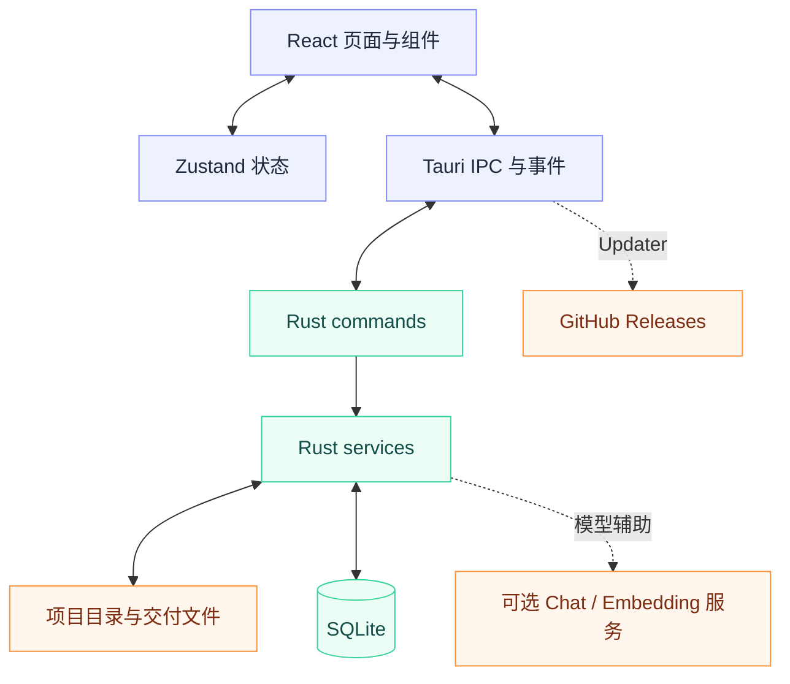

<div align="center">


# Prism Delivery Console

组织多个项目，分析依赖，构建交付包。

[](https://github.com/alanbulan/prism-delivery-console/releases)
[](https://github.com/alanbulan/prism-delivery-console/actions/workflows/release.yml)
[](./LICENSE)


[下载安装](#下载安装) · [核心能力](#核心能力) · [技术架构](#技术架构) · [开发与验证](#开发与验证) · [发布流程](#发布流程)

</div>

Prism Delivery Console 是面向多项目交付场景的 Tauri v2 桌面工具。React 与 TypeScript 构建界面，Rust 处理项目扫描、依赖分析和交付包构建，SQLite 保存本地数据。主开发分支为 `main`。

## 下载安装

从 [GitHub Releases](https://github.com/alanbulan/prism-delivery-console/releases) 选择版本与安装资产。原有安装说明包含 Windows `.msi` 和 NSIS `.exe`；具体可下载文件以对应 Release 的资产列表为准。

当前 [发布工作流](./.github/workflows/release.yml) 仅配置 Windows 构建目标。Tauri 的跨平台能力不等于本仓库已经提供 macOS 或 Linux 安装包，也不代表这些平台已经完成验收。

应用集成 Tauri Updater。自动更新依赖正确的发布资产、更新清单和签名配置；接入更新器不等于每次发布链路都已验证。

## 核心能力

| 交付构建 | 项目分析 | 项目管理 |
| --- | --- | --- |
| FastAPI、Vue 3 项目的模块扫描与交付包构建 | 文件索引、增量哈希与语言统计 | 自定义分类、描述与排序 |
| Python / JavaScript import 路径分析与重写 | D3 依赖拓扑、树形视图与文件/目录切换 | 多项目切换与技术栈识别 |
| 实时构建日志、构建历史与清理 | Embedding 语义检索与可选 LLM 分析报告 | 按客户保存模块选择 |

静态扫描、依赖分析与模型辅助能力应分开使用。语义检索需要配置 Embedding 服务，AI 报告需要配置兼容的模型接口；不要把模型输出作为正确性的唯一依据。

## 技术架构



| 层级 | 技术与职责 | 入口 |
| --- | --- | --- |
| 界面 | React 19、TypeScript、Tailwind CSS；构建、项目、分析与设置页面 | [src](./src) |
| 状态与可视化 | Zustand、D3；共享状态与依赖拓扑 | [前端依赖](./package.json) |
| 原生接口 | Tauri v2；命令调用、事件与更新 | [src-tauri](./src-tauri) |
| Rust 接口层 | 接收参数，调用业务服务，返回结果 | [commands](./src-tauri/src/commands) |
| Rust 业务层 | 扫描、构建、分析与模型调用 | [services](./src-tauri/src/services) |
| 数据与工具 | DTO、SQLite、统一错误处理 | [models](./src-tauri/src/models)、[utils](./src-tauri/src/utils) |

版本以 [package.json](./package.json)、[package-lock.json](./package-lock.json) 与 [Cargo.toml](./src-tauri/Cargo.toml) 为准，不通过 README 里的手写版本号判断最新发布。

## 开发与验证

### 环境

使用满足依赖要求的 Node.js，例如 **Node.js 22.12+**。本仓库使用 Vite 7，不再沿用旧 README 的 Node.js 18 起步说明；Vite 7 的要求见 [官方迁移说明](https://v7.vite.dev/guide/migration#node-js-support)。

Rust 使用与项目依赖兼容的 stable 工具链。Windows 原生构建还需要 Tauri 对应的系统开发环境，见 [Tauri 前置依赖](https://v2.tauri.app/start/prerequisites/)。精确可复现环境仍应结合锁文件核验；当前发布工作流使用的是浮动的 Node `lts/*` 和 Rust `stable`。

```sh
git clone https://github.com/alanbulan/prism-delivery-console.git
cd prism-delivery-console
npm ci
npm run tauri dev
```

`npm run dev` 只启动 Vite 前端开发服务。需要原生文件处理、数据库或更新能力时，使用 `npm run tauri dev` 启动完整桌面应用。

### 验证入口

| 项目 | 命令或证据 | 边界 |
| --- | --- | --- |
| 前端类型检查与构建 | `npm run build` | `package.json` 中定义为 `tsc && vite build` |
| 前端测试 | `npx vitest --run` | 本次文档整理未重新运行测试，不宣称通过率或覆盖率 |
| Rust 测试 | `cargo test --manifest-path src-tauri/Cargo.toml` | 测试结果与平台验收应分别记录 |
| 原生打包 | `npm run tauri build` | 构建结果受宿主平台与系统依赖影响 |
| 发布自动化 | [release.yml](./.github/workflows/release.yml) | 当前工作流执行安装依赖和构建发布，没有单独的测试步骤 |

<details>
<summary><strong>源码导航与扩展顺序</strong></summary>

```text
src/components/           共享组件
src/pages/build/          构建选择、历史和日志
src/pages/projects/       项目管理
src/pages/analysis/       概览、文件、拓扑和搜索
src/store.ts              共享状态
src/types.ts              前端类型
src-tauri/src/commands/   原生命令接口
src-tauri/src/services/   业务逻辑
src-tauri/src/models/     数据结构
src-tauri/src/utils/      工具与错误处理
```

扩展功能时，先定义数据结构与服务，再增加薄命令接口并在 `src-tauri/src/lib.rs` 注册；前端补齐类型、调用封装与界面。业务逻辑和原生接口职责应保持分离，并为行为变更补充测试。

</details>

## 发布流程


版本信息涉及 `package.json`、`src-tauri/Cargo.toml`、`src-tauri/tauri.conf.json`，并应同步受影响的锁文件。发布工作流在推送 `v*` 标签后运行，通过 `tauri-action` 构建并发布，开启 `includeUpdaterJson`。

工作流需要 `TAURI_SIGNING_PRIVATE_KEY` 与 `TAURI_SIGNING_PRIVATE_KEY_PASSWORD` 等发布配置。私钥只保存在受保护的 CI Secret 中，不进入仓库或 README。

当前配置为直接公开 Release（`releaseDraft: false`），没有独立的跨资产完整性检查阶段。发布前应核对安装包、更新资产、签名与清单的一致性；自动构建成功不能代替真实安装和升级验证。

## 能力边界

本文整理现有说明和仓库配置，不构成新的运行验收记录。macOS / Linux 支持、性能指标、覆盖率和外部模型调用效果均不因文档改版而获得额外保证。界面截图尚未补齐，因此暂不使用占位截图冒充实际产品画面。

## 许可证

[MIT License](./LICENSE)。保留原有版权与许可声明。
